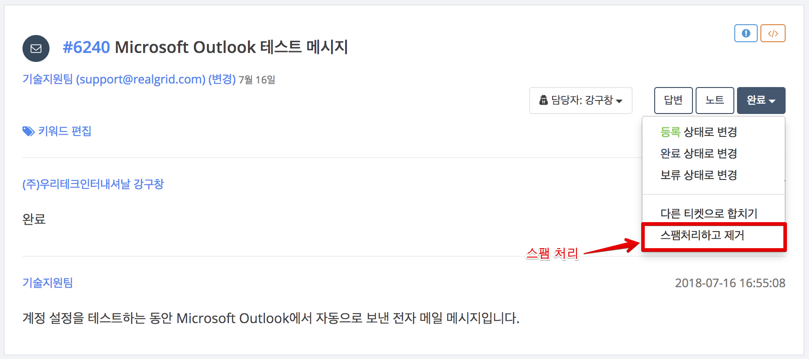
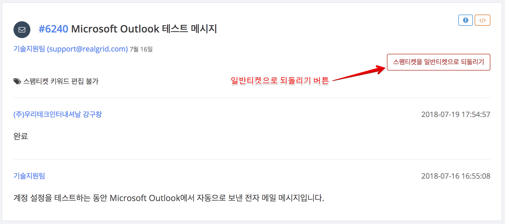

# 스팸 처리

광고성 메일이나 잘못 수신된 메일의 경우 이메일 서버를 통해 기본적인 필터링이 이루어집니다. 하지만, 그 필터를 통과한 스팸메일의 경우 어쩔수 없이 새로운 티켓으로 만들어져 티켓번호를 할당 받게 됩니다. 이 경우, 티켓 목록이나 티켓 검색에서 이 티켓을 제거하는 기능입니다. 또, 이메일 채널 뿐만아니라 웹채널이나 API채널등 다른 채널의 경우도 업무와 관련 없는 내용이 티켓으로 만들어질 수 있기 때문에 이 기능을 활용해 티켓을 제거할 수 있습니다.

### 티켓 목록에서 스팸티켓을 처리하는 방법
1. 티켓뷰에서 상태변경 버튼을 클릭
2. 팝업 메뉴에서 `스팸처리하고 제거` 버튼 클릭
3. 실행확인 메시지창에서 `확인` 버튼 클릭하면 티켓을 스팸처리
4. 실행확인 메시지창에서 `취소` 버튼 클릭하면 스팸처리 취소

### 스팸처리한 티켓의 상태
1. 티켓의 상태는 `완료` 상태가 됩니다.
2. 요청자, 담당자, 상태를 변경 할 수 없습니다.
3. 답변, 노트 등을 추가 할 수 없습니다.

### 스팸티켓을 다시 일반티켓으로 되돌리는 방법
1. `스팸티켓을 일반티켓으로 되돌리기` 버튼 클릭
2. 실행확인 메시지창에서 `확인` 버튼 클릭하면 일반티켓으로 변경
2. `최소` 버튼 클릭하면 실행 취소

