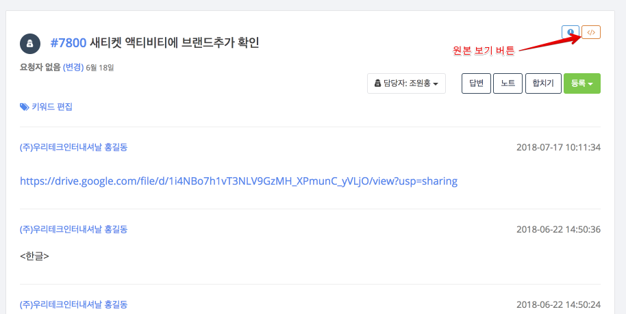
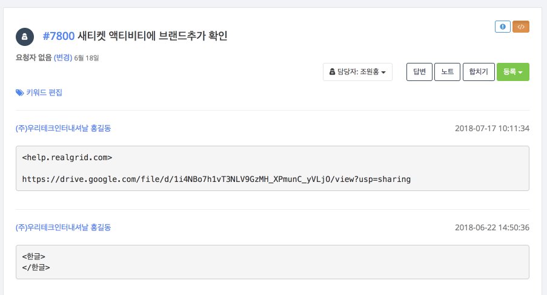

# 원본 보기
티켓의 내용을 HTML형식이 아닌 순수 TEXT형식의 원래 내용을 확인하기 위한 기능입니다.

티켓은 여러가지 다양한 채널에 의해 생성이 되다보니 다양한 형식으로 작성될 수 있습니다. 다양한 형식의 컨텐츠를 웹 화면에 HTML형식으로 표현하다 보면 정상적으로 변환하지 못하는 내용이 있을 수 있습니다. 즉, 티켓이나 활동의 내용이 표시 되지 않고 공백으로 보이는 현상이 있을 수 있습니다.
원본 보기 기능은 이 경우 티켓이나 활동의 컨텐츠에 대한 원본 내용을 눈으로 확인할 수 있게 화면에 표시합니다.

1. 원본 보기 버튼<kbd></></kbd>을 누릅니다.
2. 요청자의 티켓 내용이나 상담원의 답변 내용등 모든 내용의 원본이 보여집니다.

